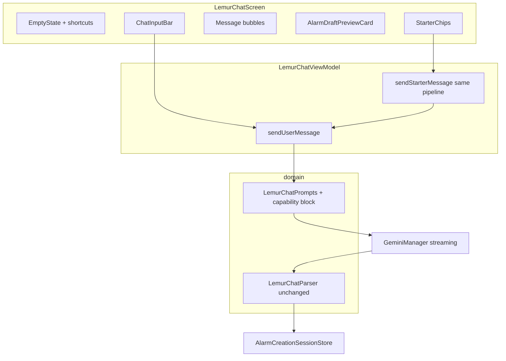

# Proactive Lemur chat UX (Gemini-only, no schema change)

## Executive summary

Lemur chat today opens on an empty thread and only moves forward when the user types; advanced alarm behavior is easy to miss because the UI and system prompt do not surface it. This change adds **local onboarding** (copy + wizard/detail shortcuts), **translated starter chips** that submit canned user messages through the **existing** Gemini streaming and `<<<JSON>>>` / `propose_alarm` path—no schema or navigation graph changes—and a **compact English capability block** in prompts so the model steers power users toward the wizard or detailed editor. Work can proceed in parallel on UI, ViewModel, strings, and prompts; ship on a non-`main` branch with JVM tests on prompt text, Hebrew/iw string parity, RTL manual checks, and light accessibility requirements for chips and onboarding.

## Definition of done (acceptance checklist)

**Layout (supersedes item below, ~May 2026):** Starter chips and [`ChatInputBar`](app/src/main/java/com/elroi/lemurloop/ui/screen/alarm/LemurChatScreen.kt) live in the **scrollable thread** (`LazyColumn`) and **`bottomBar` is composer-only**; see plan `new-alarm-chat-thread-layout` in `.cursor/plans/`. The bullet about chips in `bottomBar` is **obsolete**.

- **Onboarding gate:** A single derived flag (e.g. `showOnboarding = state.messages.isEmpty()`) controls **both** the empty-state block and the starter-chip row.
- **Sending state:** While `isSending` is true, starter chips are **disabled** (or non-interactive) so users cannot start overlapping turns; send button/input behavior stays consistent with today.
- **Layout:** [`ChatInputBar`](app/src/main/java/com/elroi/lemurloop/ui/screen/alarm/LemurChatScreen.kt) stays in **`Scaffold.bottomBar`** with scaffold-level **`imePadding()`**. Starter chips and onboarding live in the **`LazyColumn`** thread above messages; chips disabled while `isSending`.
- **Strings:** `lemur_chat_starter_prompts` `string-array` exists in `values/`, `values-iw/`, and `values-he/` with the **same item count** across locales; other new copy added in all three; wording aligned with [docs/HEBREW-TRANSLATION-GLOSSARY.md](docs/HEBREW-TRANSLATION-GLOSSARY.md) where applicable.
- **Prompts:** `buildStreamingPrompt` and **`buildRepairPrompt`** both include the same capability/limitations content (prefer a **shared private helper** in `LemurChatPrompts` to avoid drift); block stays **short** (bullet-style, no duplicate of full settings prose).
- **Tests:** [`LemurChatPromptsTest`](app/src/test/java/com/elroi/lemurloop/domain/chat/LemurChatPromptsTest.kt) passes and asserts key phrases for the streaming prompt (and repair prompt if it embeds the shared block).
- **Docs:** [docs/RTL-LOCALIZATION.md](docs/RTL-LOCALIZATION.md) gains a LemurChat manual QA row (empty state, chips, preview hint, Hebrew).
- **Regression:** Missing API key path, overflow navigation to wizard/detail, and draft preview persist behavior remain correct.

## Interaction and edge cases

- **Onboarding vs first message:** Tapping a chip adds the user message immediately, so `showOnboarding` becomes false while the assistant is still streaming—that is intentional; chips must still respect **`isSending`** so double-tap does not enqueue a second turn.
- **Starter copy quality:** Prefer prompts that are clear in **local time** (e.g. weekday alarm, one-time, labeled wake) and avoid vague relative phrasing like “tomorrow” without context if it confuses users or the model near midnight.

## Accessibility

- Chips: meaningful **`contentDescription`** (e.g. repeat prompt or “Suggested prompt: …”); **minimum 48dp** touch targets per project UI conventions.
- Empty state: title (and section if applicable) readable by TalkBack; shortcut buttons reuse clear string labels.

## Prompt engineering constraints

- **Token budget:** Keep the capability appendix brief—short bullets naming what chat cannot configure vs wizard/detail—not a dump of every settings row.
- **Repair parity:** Repair turns must not drop capability guidance; implement via the same shared snippet used by `buildStreamingPrompt`.

## Localization process

- New user-visible strings and the starter `string-array`: English + `values-iw` + `values-he`; follow [docs/RTL-LOCALIZATION.md](docs/RTL-LOCALIZATION.md) and [docs/HEBREW-TRANSLATION-GLOSSARY.md](docs/HEBREW-TRANSLATION-GLOSSARY.md) for consistent alarm-domain wording.

## Post-v1 backlog (out of scope here)

- Analytics on which starter chips fire; A/B different prompt sets.
- CI or script asserting `string-array` length parity across `values*` qualifiers.
- Robolectric or UI smoke for chip row + IME if desired later.
- Optional nav arg for preselected starter id.

## What exists today (agreed baseline)

- Entry: FAB clears the shared session via [`AlarmViewModel.resetAlarmCreationSession()`](app/src/main/java/com/elroi/lemurloop/ui/viewmodel/AlarmViewModel.kt) → [`AlarmCreationSessionStore.resetSession()`](app/src/main/java/com/elroi/lemurloop/domain/creation/AlarmCreationSessionStore.kt), then [`NewAlarmBottomSheet`](app/src/main/java/com/elroi/lemurloop/ui/screen/alarm/NewAlarmBottomSheet.kt) → Chat navigates to [`Screen.LemurChat`](app/src/main/java/com/elroi/lemurloop/ui/navigation/Screen.kt) / [`LemurChatScreen`](app/src/main/java/com/elroi/lemurloop/ui/screen/alarm/LemurChatScreen.kt).
- Streaming + merge: [`LemurChatViewModel`](app/src/main/java/com/elroi/lemurloop/ui/viewmodel/LemurChatViewModel.kt) → [`GeminiManager`](app/src/main/java/com/elroi/lemurloop/domain/manager/GeminiManager.kt); structured output via [`LemurChatPrompts`](app/src/main/java/com/elroi/lemurloop/domain/chat/LemurChatPrompts.kt) + [`LemurChatParser`](app/src/main/java/com/elroi/lemurloop/domain/chat/AlarmProposal.kt) and [`AlarmDraftFactory.mergeProposal`](app/src/main/java/com/elroi/lemurloop/domain/chat/AlarmProposal.kt) into the shared draft.
- Advanced fields (math, buddy/SMS, smile-to-dismiss, briefing/TTS, smart wakeup, evasive snooze, etc.) live on [`Alarm`](app/src/main/java/com/elroi/lemurloop/domain/model/Alarm.kt) but are **not** in `propose_alarm`; users already reach them from chat via overflow → wizard / detailed on [`AlarmDraftPreviewCard`](app/src/main/java/com/elroi/lemurloop/ui/screen/alarm/LemurChatScreen.kt).

## Product intent

| Problem                     | Direction                                                                                                                                                                                                                                             |
| --------------------------- | ----------------------------------------------------------------------------------------------------------------------------------------------------------------------------------------------------------------------------------------------------- |
| Passive / blank start       | When `messages` is empty, show a **local** onboarding block (no extra Gemini call): what chat is for, privacy reminder already in app bar, and **starter chips** that send canned user messages.                                                      |
| Advanced features invisible | **System prompt** lists capabilities chat cannot set and instructs the model to recommend **wizard** or **detailed editor** when the user asks; **UI** adds a short hint on the preview card and optional one-line copy on the bottom sheet Chat row. |
| Scope                       | **No** native function calling, **no** new JSON keys, **no** new nav routes or `SavedStateHandle` args for v1 (keeps one `LemurChatViewModel` + one graph destination).                                                                               |

## Implementation sequencing (parallel work)

`prompt-capabilities` only affects what Gemini says in replies; it is **not** a hard dependency for UI or VM wiring. **`vm-starter-send`**, **`compose-empty-chips`**, and **`strings-rtl`** can proceed in parallel with (or slightly ahead of) prompt edits. Merge order is flexible; avoid blocking the whole effort on the prompt task alone.

## UX / navigation (concrete)

**Onboarding visibility (single source of truth):** In `LemurChatScreen`, derive once, e.g. `val showOnboarding = state.messages.isEmpty()`, and use **the same** `showOnboarding` for both the empty-state block and the starter-chip row. That keeps empty state and chips in lockstep (no independent flicker on configuration change or partial recomposition).

1. **Empty thread (`showOnboarding`)** — Top of the message list (before bubbles): title + 2–3 lines of body (string resources). Include two **text buttons** or links: “Open wizard” / “Open detailed editor” reusing the same callbacks as the preview overflow ([`onNavigateToWizard`](app/src/main/java/com/elroi/lemurloop/ui/navigation/LemurLoopNavGraph.kt), [`onNavigateToDetailed`](app/src/main/java/com/elroi/lemurloop/ui/navigation/LemurLoopNavGraph.kt)) so users can bail out without typing.
2. **Starter chips (`showOnboarding`)** — Horizontally scrollable row **in the `LazyColumn`** (in-thread), **above** real message bubbles and **below** onboarding; [`ChatInputBar`](app/src/main/java/com/elroi/lemurloop/ui/screen/alarm/LemurChatScreen.kt) remains **only** in `bottomBar`. 3–5 presets. Tapping a chip calls ViewModel API that **reuses the same path as** `sendUserMessage`. **Chip copy:** `string-array` in `values/`, `values-iw/`, `values-he/`.
3. **Preview card** — Under [`lemur_chat_preview_title`](app/src/main/res/values/strings.xml), add one line of neutral copy: advanced options are in wizard/detail (new strings EN + [`values-iw`](app/src/main/res/values-iw/strings.xml) + [`values-he`](app/src/main/res/values-he/strings.xml) per [RTL doc](docs/RTL-LOCALIZATION.md)).
4. **New alarm sheet (optional but small)** — Under the Chat option title, add `supportingText` / secondary `Text` (one line) that sets expectation: quick time + repeat in chat; fine-tuning elsewhere. Uses new strings; same three callbacks, **no** nav signature change.

## Layering (architecture rules)

- **domain/** — Add a **shared** English **“App capabilities”** snippet (private helper) included by both [`buildStreamingPrompt`](app/src/main/java/com/elroi/lemurloop/domain/chat/LemurChatPrompts.kt) and [`buildRepairPrompt`](app/src/main/java/com/elroi/lemurloop/domain/chat/LemurChatPrompts.kt): what `propose_alarm` may contain; short bullet list of features that require the **detailed alarm editor** or **wizard**; instruction to mention that in natural language when relevant. Keep the block **English** and **brief**; all **new user-visible** strings stay in resources (Hebrew/English).
- **ui/** — [`LemurChatScreen`](app/src/main/java/com/elroi/lemurloop/ui/screen/alarm/LemurChatScreen.kt): new private composables for empty state + chip row; thin—state from existing `LemurChatUiState`, events as new `LemurChatViewModel` methods (same pattern as `onInputChange` / `sendUserMessage`).
- **Navigation** — No new `Screen` routes; optional later: nav args for `starterId` if you want FAB→preselected chip without scope creep now.

## Persona review (embedded)

- **Maintainer:** One place for model instructions (`LemurChatPrompts`); **starter chip text** in `string-array` resources (EN + iw + he); other copy in `strings.xml`. Avoid duplicating send logic—starter calls into shared private `sendUserMessageInternal` or forwards to `sendUserMessage` after setting `inputText`.
- **Product/UX:** No silent Gemini spend on open; first turn is still user-initiated (chip or keyboard). Clear exit ramps to wizard/detail.
- **QA / testability:** Prompt behavior covered by JVM tests; RTL manual row: add LemurChat to the checklist in [docs/RTL-LOCALIZATION.md](docs/RTL-LOCALIZATION.md) when implementing (table row for empty state, chips, preview hint).
- **Accessibility:** Chips and onboarding shortcuts meet labeling and touch-target expectations (see Accessibility section).
- **Performance:** Chips + empty state are static Composables; no list of messages change.

## Tests (where it matters)

- **New** [`app/src/test/java/com/elroi/lemurloop/domain/chat/LemurChatPromptsTest.kt`](app/src/test/java/com/elroi/lemurloop/domain/chat/LemurChatPromptsTest.kt): assert `buildStreamingPrompt(...)` contains key capability phrases (math challenge, buddy/SMS, wake-up check / smart wakeup, smile-to-dismiss, briefing—wording aligned with final prompt). If repair uses the shared snippet, assert the same phrases appear in `buildRepairPrompt(...)` (or test the helper once if exposed `internal` for tests).
- **Optional:** `LemurChatViewModel` test with `MockK` relaxed `GeminiManager` (pattern in [`SettingsCompactionTest`](app/src/test/java/com/elroi/lemurloop/ui/viewmodel/SettingsCompactionTest.kt)) verifying `sendStarterMessage` sets `isSending` and appends user message—only if cheap; otherwise skip to avoid flaky streaming tests.

## Explicit non-goals (this task)

- Gemini function calling, new `propose_*` JSON, or persisting transcripts.
- Splitting chat into multiple ViewModels or sessions.
- Large refactors of [`LemurChatUiState`](app/src/main/java/com/elroi/lemurloop/ui/viewmodel/LemurChatViewModel.kt) beyond fields needed for chips if any (prefer none: chip labels come from `string-array` only).

## Implementation branch

Per workspace rules: implement on a feature branch (e.g. `feature/chat-starters`), not `main`.
